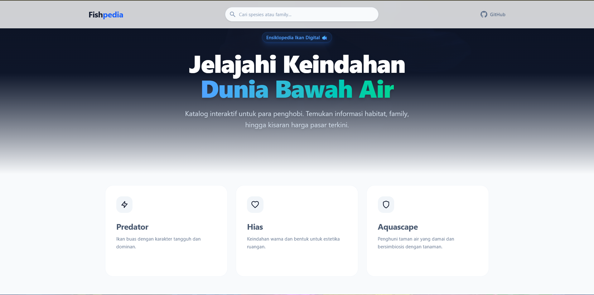
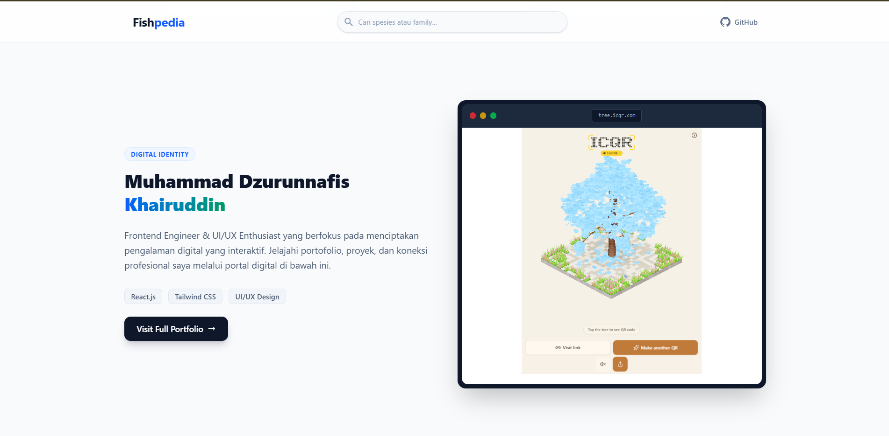

# 🐟 Fishpedia - Interactive Fish Encyclopedia

<div align="center">
  
  
  
  
</div>

<br />

**Fishpedia** adalah ensiklopedia ikan digital interaktif yang dirancang untuk membantu penghobi akuarium mengenali berbagai spesies, memahami habitat aslinya, dan mengetahui kisaran harga pasar terkini. Dibangun dengan fokus pada UI/UX yang modern, responsif, dan data-driven.
## 📸 Screenshots

<div align="center">
  
  
</div>

<br />


> ⚠️ **Status Saat Ini:** v1.0 (Prototype)  
> Data dan gambar saat ini masih menggunakan *dummy data* untuk keperluan demonstrasi UI/UX.

## ✨ Fitur Utama (v1.0)

-   🗂️ **Kategorisasi Cerdas:** Filter berdasarkan Predator, Hias, dan Aquascape.
-   🔍 **Pencarian Real-time:** Cari berdasarkan nama spesies atau family.
-   📊 **Grouping by Family:** Daftar ikan dikelompokkan secara otomatis per keluarga taksonomi.
-   🎨 **Modern UI/UX:** Glassmorphism, animasi halus, dan desain responsif tanpa emoji berlebihan.
-   📱 **Mobile First:** Tampilan optimal di semua ukuran perangkat.
-   💡 **Interactive Modal:** Detail ikan ditampilkan dalam popup yang elegan tanpa pindah halaman.

## 🚀 Roadmap Pengembangan

Proyek ini dikembangkan secara bertahap dengan target fitur sebagai berikut:

### v1.1 — UI & Data Enhancement
- [ ] Dark mode toggle
- [ ] Improved search & filtering logic
- [ ] Sorting berdasarkan nama / harga
- [ ] Dedicated fish detail page (non-modal)
- [ ] Penambahan data spesies yang lebih lengkap
- [ ] Favorite ikan menggunakan LocalStorage

### v1.2 — JSON / Public API Integration
- [ ] Migrasi data dari hardcode ke file JSON terpisah
- [ ] Implementasi `fetch()` untuk pengambilan data
- [ ] Loading skeleton & error state handling
- [ ] Dynamic category & family generation
- [ ] Pagination / Infinite scroll untuk dataset besar

### v1.5 — Advanced React Patterns
- [ ] Custom Hooks (`useFishData`, `useFavorites`, dll)
- [ ] React Router untuk navigasi multi-halaman
- [ ] Context API untuk global state management
- [ ] Advanced filtering & URL-based filtering (shareable links)
- [ ] Rendering optimization (`useMemo`, `useCallback`)

### v2.0 — Express API Backend
- [ ] REST API menggunakan Express.js
- [ ] Endpoint CRUD untuk ikan, kategori, dan family
- [ ] MySQL database integration
- [ ] API validation & error handling middleware
- [ ] Dokumentasi API (Swagger / Postman)

### v2.5 — Aquarium Tools 🧮
- [ ] Kalkulator volume air & kebutuhan tank
- [ ] Rekomendasi jumlah ikan berdasarkan ukuran akuarium
- [ ] Informasi parameter air dasar (pH, suhu, GH/KH)
- [ ] Sistem rekomendasi kompatibilitas ikan

### v3.0 — Fishpedia Platform
- [ ] Admin dashboard untuk manajemen data
- [ ] Upload gambar & validasi media
- [ ] Statistik & analytics spesies
- [ ] Authentication sistem admin
- [ ] User favorites / personal collection
- [ ] Fish comparison tool (side-by-side)

### v4.0 — Aquarium Ecosystem 🌐
- [ ] Integrasi dengan platform IkanKu
- [ ] Monitoring aquarium berbasis IoT
- [ ] Data sensor realtime (suhu, pH, TDS)
- [ ] Profil akuarium personal user
- [ ] Rekomendasi ikan berbasis kondisi akuarium aktual
- [ ] Riwayat & grafik parameter air

## 🛠️ Tech Stack

| Technology | Purpose |
| :--- | :--- |
| React 18/19 | Core UI Library |
| Tailwind CSS | Utility-first Styling |
| Vite | Build Tool & Dev Server |
| JavaScript (ES6+) | Programming Language |

## 📦 Installation

```bash
# Clone repository
git clone https://github.com/Tokitakun/fishpedia.git

# Install dependencies
npm install

# Run development server
npm run dev
